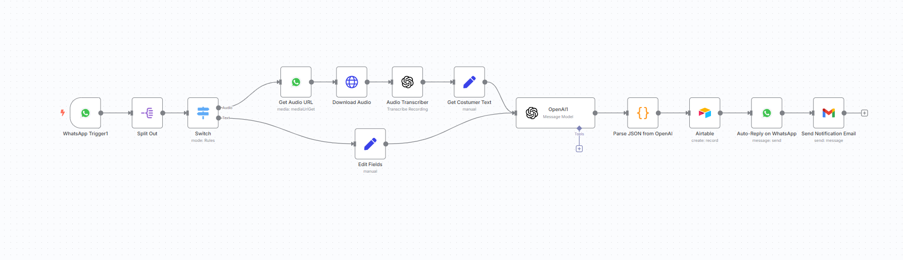
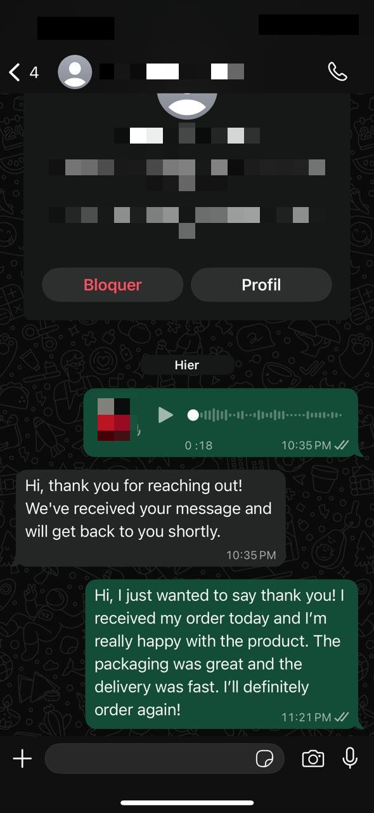
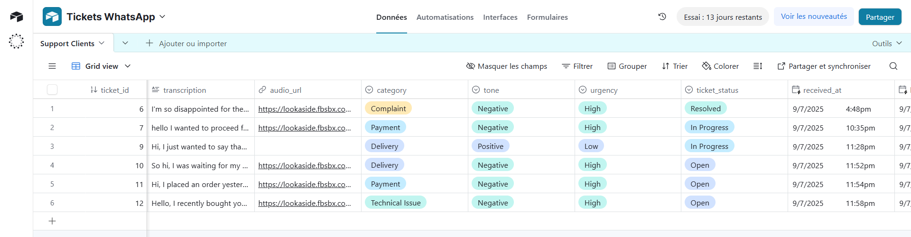

# Whatsapp Voice and Text Support Handler

## 📌 Description du projet

Ce projet est un système d’assistance multi-agent sur **WhatsApp**, capable de gérer à la fois les **messages texte** et les **messages vocaux** des clients.  
Il utilise n8n pour automatiser la réception, le traitement et le stockage des messages dans une base de données Airtable, permettant un suivi précis des tickets et de leur statut.

---

## 🖼️ Captures d'écran

### 1️⃣ Workflow complet sur n8n
  
Cette capture montre l’ensemble du workflow configuré sur n8n, incluant tous les agents et traitements automatiques pour les messages WhatsApp.

### 2️⃣ Interface de discussion sur WhatsApp
  
Exemple de conversation client : le système peut recevoir et envoyer des messages texte et vocaux, démontrant la capacité du support automatisé.

### 3️⃣ Base de données Airtable
  
Cette capture présente la manière dont les messages sont stockés et classés dans Airtable, avec des attributs tels que :  
- Catégorie du message  
- Durée du message vocal  
- Tonalité (énervé, content, neutre)  
- Statut du ticket (en cours, résolu, urgent)  
- Heure de réception  
- Priorité de traitement  

---

## 📄 Fichier du projet

Le projet inclut également le fichier **`workflow_code.json`**, qui contient l’exportation complète du workflow n8n.  
Il peut être importé directement dans n8n pour reproduire le système tel qu’il est configuré.

---

## ⚙️ Fonctionnalités principales

- Gestion automatique des messages texte et vocaux sur WhatsApp  
- Classification et suivi des tickets clients dans Airtable  
- Priorisation et statut des messages selon l’urgence et la tonalité  
- Exportation et importation du workflow via `workflow.json`  

---

## 🔗 Contact

Pour toute question ou collaboration :  
📧 *youssefbenyahia6@gmail.com*  
🌍 Portfolio : *https://youssef0612.github.io/Portfolio/*

